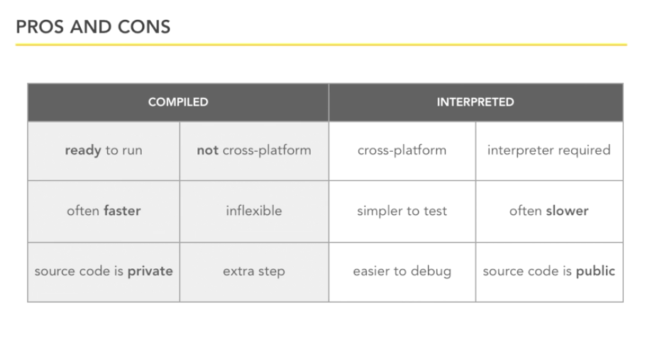
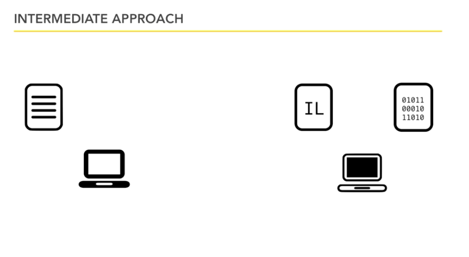
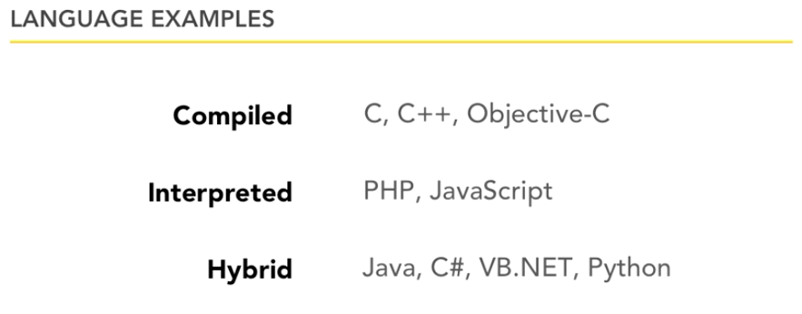

#Foundations of Programming

*"A computer program is a set of instructions..."*

Think of directions to get from point A to point B; breaking a part a complex task into its smaller, simpler parts.

---

_Statements_ - like sentences in English. They use words, numbers and punctuation to express one thought.

The CPU (brain of any computer) only understands machine code. Programming languages are invented languages that bridge the gap between humans and machines. 

The closer a language is to machine code (e.g. assembly language) the harder it is to write. These are called low-level languages. 

It's more common to use high-level languages like JavaScript. This code is easier to write and share.

We write the *source code* that will be translated down to *machine code*.

3 things to know when beginning programming:

* how do we write the source code?
* we need to understand how our source code will be converted to machine code
* how do we execute our program

---

**Compiling** the Source Code: source code runs through a compiler. that 'executable' file can now run the program

**Interpreting** the Source Code: code isn't compiled before sharing. It is 'interpreted' by the destination machine (e.g. JavaScript)

**Intermediate (Hybrid) Approach**: Since there are good things about compiled languages and good things about interpreted languages, there is also a third way of doing this which is a bit of both. Instead of the *compiled* model where all the work is done upfront but can be a little bit inflexible or the *interpreted* model where all the work is done on the receiving end but can be a little bit slower, we kind of do half-and-half. Upfront, we compile it part of the way to what's called an *intermediate language*, which takes it as far along the way to machine code as it can get while still being portable often across platforms. You then distribute this, sending it to the people who need to run it, and each person who runs it takes it the last step to take it to machine code on their computers. This is sometimes referred to as Just-In-Time or JIT compilation. Now, this intermediate language sometimes also goes by the name of bytecode. So this process has to happen somehow.

---

*source: [https://www.lynda.com/Programming-Foundations-tutorials/Foundations-Programming-Fundamentals/83603-2.html](https://www.lynda.com/Programming-Foundations-tutorials/Foundations-Programming-Fundamentals/83603-2.html)*